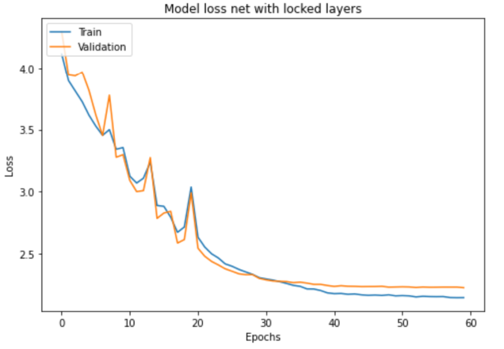
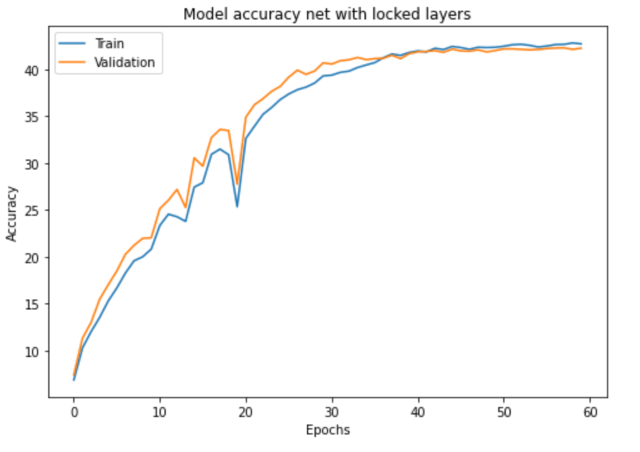
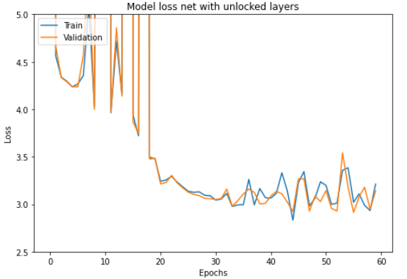
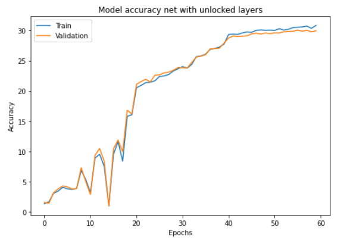

#s.arslanov
 In this project I was experimenting with models from torchvision and transfer learning.

As a dataset I used CIFAR100, as a model - pretrained wide resnet 101.
The results have shown that models with off-the-shelf pre-trained layers were trained faster and showed better results than models without locked layers (it took ~20/~40 epochs for each models to get same val. accuracy(30%))

Results of training wide resnet 101 with locked layers:
- Loss on last epoch:

    Train: 2.1458094140625\
    Val: 2.225779724121094
    

- Accuracy on last epoch:

    Train: 42.704%\
    Val: 42.24%
    

- F1-score on last epoch:

    Train: 0.419896481983808\
    Val: 0.41081099266738513
    

Results of training wide resnet 101 with unlocked layers:
- Loss on last epoch:

    Train: 3.21356390625\
    Val: 3.1413391845703127
    

- Accuracy on last epoch:

    Train: 30.852%\
    Val: 29.96%
    

- F1-score on last epoch:

    Train: 0.294856763406261\
    Val: 0.2844481439739899
    

So, comparing the received results, we could see that:
1. F1-score in the first nn in 1.44 times greater than the score in the second nn. Thus, the first nn classifies images to classes in 1.44 times better than unlocked nn.
2. The first nn in 1.41 times makes accurate predictions than unlocked nn.
3. According to graphics of loss, nn with locked layers is smooth and converging easier comparing to loss of other nn, thus having no changing layers makes learning more efficient and faster.
4. Analyzing accuracies graphs of two nn, we could see that both functions went on a plateau, but nn with locked layers shows better results, therefore we preferably should use it.

Having considered all this, the neural network with off-the-shelf pre-trained layers is a good way to speed up learning.

